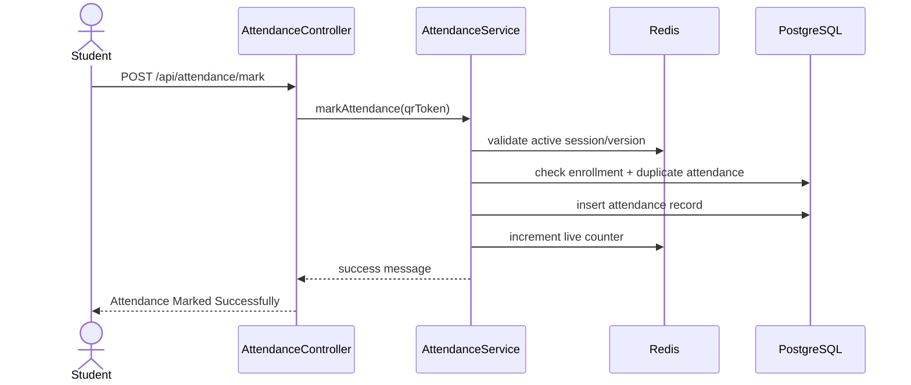

`src/main/resources/application.yaml` configures:
- application name: `user-service`
### 5.1 Runtime Configuration
## 5. Configuration Design
- **DTOs** are used to keep the API contract separate from persistence entities.
- **Mappers** convert between DTOs and entities.
- **Repositories** isolate database access.
- **Services** contain business logic and transaction boundaries.
- **Controllers** expose REST endpoints.
### 4.5 Data Design Patterns
1. Controller receives REST request.
2. Request payload is mapped into a DTO or request object.
3. Service validates business rules.
4. Service calls repository to persist or fetch entities.
5. Mapper converts entity to DTO for response.
6. Controller returns structured JSON response.
### 4.4 Common Request Lifecycle
Typical responsibilities:
- JPA entities
- Repositories
- Controllers
- Service implementations
- Domain-specific enums and helpers
#### Internal Layer
The `internal` packages contain persistence and business logic.
Typical responsibilities:
- DTO definitions
- Public service contracts
- Mapper interfaces
- Request objects used by controllers
#### API Layer
The `api` packages contain request/response contracts and shared interfaces.
### 4.3 Layer Responsibilities
- **Spring Kafka**
# User Service

It currently covers the core domain modules for:

- `admin`
- `student`
- `teacher`
- `course`
- `classroom`
- `department`
- `timetable`

A Spring Boot-based **user-service** for a microservices-oriented college attendance system. The service is organized around role-based user management and is split into feature modules such as `student`, `teacher`, `admin`, `course`, `classroom`, `department`, and `timetable`.

---

## 1. Project Goals

The system is intended to:

1. Manage users and role-based profiles.
2. Support college master data such as courses, classrooms, departments, and timetables.
3. Provide secure authentication and authorization.
4. Add QR-based attendance marking for class sessions.
5. Store permanent records in PostgreSQL and temporary attendance session state in Redis.
## 1. Project Overview

### Main goals
- Manage users and their role-based profiles.
- Keep feature modules isolated using a modular package structure.
- Support persistence with JPA and PostgreSQL.
- Support security and token-based integrations.
- Prepare the service for event-driven extension using Spring Modulith + Kafka.
- **PostgreSQL** for production persistence
- **H2** for tests
- **Redis** for temporary QR session state and counters
From `pom.xml` and the runtime configuration, the service uses:
- **Lombok** for boilerplate reduction
- **JJWT** for JWT token handling
- **ZXing** for QR code generation

---

## 3. High-Level Design (HLD)

- **PostgreSQL** for production/runtime persistence

- Web admin panel
- Teacher dashboard
- Student mobile app
- timetable-driven class scheduling
- QR attendance session creation
- attendance scan validation and persistence
- **JJWT** for JWT-related token support

### 3.2 HLD Overview

```text
Client Apps
   |
   v
REST Controllers / WebSocket Gateway
   |
   v
The `user-service` is one service in a larger attendance system. It is responsible for user-facing identity and role-based profile management.
Typical responsibilities:
### 3.2 High-Level Architecture
```

### 3.3 Modulith View

This repository is organized as a **feature-modular monolith**:

| Module | Responsibility |
|---|---|
| `admin` | admin profile, admin operations, approvals, reporting |
Client / Postman / Frontend
        |
        v
REST Controllers
        |
        v
Service Layer / Business Logic
        |
        v
Repository Layer (Spring Data JPA)
        |
        v
Database (PostgreSQL in runtime, H2 in tests)
| `attendance` *(planned / to add)* | attendance sessions, mark attendance, audit trail |
### 3.3 Modular HLD View
The codebase is organized as a feature-modular monolith:

### 3.4 Key Runtime Flows

- `admin` – admin profile and admin-related operations
- `student` – student profile, login helpers, and student-specific services
- `teacher` – teacher profile and teacher-specific operations
- `course` – course management and teacher-course mapping
- `classroom` – classroom/room management
- `department` – department data and related logic
- `timetable` – timetable entries and schedule handling
- `config` – application-wide configuration such as security
3. Analytics and notification listeners can react independently.

### 3.5 HLD Quality Goals

- modular boundaries using Spring Modulith
- secure, short-lived QR tokens
- no raw database identifiers inside QR payloads
- scalable attendance state with Redis TTLs
- auditable attendance lifecycle
### 3.4 Runtime Flow

---

A typical request follows this flow:
│   │       ├── student/
│   │       ├── teacher/
│   │       └── timetable/
│   └── resources/
│       └── application.yaml
└── test/
    ├── java/
    │   └── org/college/user_service/
    └── resources/
        └── application-test.yaml
```

### 4.2 Package Responsibilities

1. A request comes in through a controller.
2. The controller delegates to a service.
3. The service validates input and applies business rules.
4. The service uses a repository to read/write entities.
5. DTOs are used at the API boundary to avoid exposing entities directly.
### 3.5 HLD Notes
  - WebSocket configuration
  - Jackson / serialization customization
  - exception handling support

#### `org.college.admin`
- The service uses a **many-to-one / one-to-one / many-to-many style domain model** depending on the feature.
- The project is prepared for **event-driven integration** through Spring Modulith and Kafka dependencies.
- Test configuration is separated from runtime configuration.
  - `StudentController.java`
  - `StudentJwtUtil.java`
  - `StudentMapper.java`
  - `StudentMapperImpl.java`
  - `StudentRepository.java`
  - `StudentService.java`
  - `StudentRepository.java`
  - DTOs and mappers
  - JWT helper utilities

#### `org.college.teacher`
- Teacher profile and teacher workflow support.
- Typical files:
  - `Teacher.java`
  - `TeacherController.java`
  - `TeacherService.java`
  - `TeacherRepository.java`
  - `TeacherMapper.java`
  - teacher-specific API contracts

#### `org.college.course`
- Course master data and teacher assignment.
- Typical files:
  - `Course.java`
  - `CourseController.java`
  - `CourseService.java`
  - `CourseRepository.java`
### 4.2 Package-by-Package LLD

- Contains the Spring Boot entry point.
- `UserServiceApplication` bootstraps the application.

#### `org.college.department`
- Holds cross-cutting configuration.
- `SecurityConfig` defines security-related behavior.
- attendance session entity
- attendance mark entity
- audit log entity
- attendance service
- attendance controller
- attendance events

##### `qr-session`
- `api/`
  - `AdminDTO.java`
  - `ChangePasswordRequest.java`
- `internal/`
  - `Admin.java`
  - `AdminController.java`
  - `AdminMapper.java`
  - `AdminRepo.java`
  - `AdminService.java`

- request DTOs
- `api/`
  - `StudentDTO.java`
- `internal/`

- resolve roles, timetable slots, and session state server-side

### 5.2 Service Layer
- `api/`
  - `CreateTeacherRequest.java`
  - `TeacherDTO.java`
  - `TeacherLoginDetails.java`
  - `TeacherManagement.java`
  - `TeacherManagementImpl.java`
- `internal/`
  - `TeacherService.java`
- Redis coordination
- persistence orchestration

### 5.3 Repository Layer
- `api/`
  - `CourseDTO.java`
  - `CourseManagement.java`
  - `CreateCourseRequest.java`
- `internal/`
  - `CourseManagementImpl.java`
- attendance history lookup
  - `CourseService.java`

### 5.4 Controller Layer
- `api/`
  - `ClassroomDTO.java`
  - `ClassroomManagement.java`
- `internal/`
- Department module for department-related entities and operations.
- `api/`
  - `ApiResponse.java`
  - `CreateTimetableEntryRequest.java`
  - `TimetableEntryDTO.java`
- `internal/`
  - `TimetableEntry.java`
  - `TimetableController.java`
  - `TimetableRepository.java`
  - `TimetableService.java`
    SVC->>TT: find active timetable slot
    TT-->>SVC: timetable slot
    SVC->>DB: persist attendance_session
    SVC->>REDIS: store active QR session with TTL
    SVC-->>API: session + qr token
    API-->>Teacher: QR displayed
```

### 14.2 Student marks attendance



---

## 15. Testing Strategy

This system should be testable at multiple levels:

### Unit tests

- QR token generation/validation
- attendance business rules
- duplicate prevention
- role authorization helpers

### Repository tests

- unique constraint checks
- attendance lookup queries
- timetable session queries

### Controller tests

- success and failure scenarios
- unauthorized access checks
- invalid QR payload handling

### Integration tests

- Redis session expiry behavior
- event listener behavior
- WebSocket/SSE updates

### Test command

```bash
mvn test
```

> If the build fails, verify the Maven dependency versions and Spring Modulith BOM alignment first.

---

## 16. Configuration Files

### `src/main/resources/application.yaml`
Holds runtime configuration for:

- application name
- PostgreSQL datasource
- JPA/Hibernate behavior
- SQL formatting and naming strategy
- default Spring Security user properties
- logging settings

### 5.2 Test Configuration
- JPA/Hibernate options
- security properties
- logging levels

`src/test/resources/application-test.yaml` configures:
- in-memory H2 database
- `ddl-auto: create-drop`
- H2 console support
### `src/test/resources/application-test.yaml`
Holds test configuration for:

This keeps tests isolated from the production database.
- H2 database
- isolated test schema behavior
- reduced dependency on external services

---

## 6. Build and Test Structure

### Maven Build
The project uses Maven with:
- `spring-boot-maven-plugin`
- `maven-compiler-plugin`
- Lombok annotation processing

### Test Layout
Tests live under:
- `src/test/java/org/college/user_service/`

Reported test artifacts are written to:
- `target/surefire-reports/`
## 17. Build Output

---
The `target/` directory contains generated files such as:

## 7. Generated Output / Target Directory

The `target/` folder contains generated build output, including:
- packaged JAR files
- compiled classes
- packaged JARs
- generated sources
- test classes
- Surefire test reports
- test reports
- Maven metadata

This directory should be treated as build output, not source of truth.

---

## 8. Naming and Structure Notes

A few structural observations are worth noting:

- Source code is organized under `org.college`.
- Test code uses `org.college.user_service`.
- The Maven coordinates still show older names in `pom.xml` (`com.example` / `demo`).
- The `target/` folder contains some older compiled package paths as well.

These look like project history / refactoring leftovers and may be worth cleaning up later for consistency.
Treat this folder as build output only.

---

## 9. Suggested Module Responsibilities Summary
## 18. Current Structure Summary

| Module | Responsibility |
| Package | Purpose |
|---|---|
| `admin` | Admin profile and admin-specific management |
| `student` | Student profile, login helpers, and student operations |
| `teacher` | Teacher profile and teacher operations |
| `course` | Course catalog and course assignment logic |
| `classroom` | Classroom/room management |
| `department` | Department master data |
| `timetable` | Timetable entries and scheduling |
| `config` | Security and application-level configuration |
| `admin` | admin workflows and admin profile management |
| `student` | student profile, login helper logic, and student services |
| `teacher` | teacher profile and teaching workflows |
| `course` | course catalog and course assignment |
| `classroom` | rooms and classroom inventory |
| `department` | department master data |
| `timetable` | schedule and active slot lookup |
| `config` | security and infrastructure configuration |

---

## 19. Production Recommendations

1. Keep the project modular and avoid cross-module entity leakage.
2. Use DTOs at API boundaries.
3. Use `@Transactional` only in service methods that change state.
4. Keep QR sessions short-lived and server-validated.
5. Store only permanent attendance data in PostgreSQL.
6. Use Redis only for temporary session state and counters.
7. Add audit logs for session start, close, and mark events.
8. Standardize package names and Maven coordinates.
9. Externalize secrets such as DB passwords and JWT keys.
10. Add module-level tests before exposing live attendance in production.

---

## 10. How to Run
## 20. Run Locally

```bash
mvn clean spring-boot:run
```

For tests:
Run tests:

```bash
mvn test
```

---

## 11. Future Improvements
## 21. Final Summary

- Align Maven coordinates with the actual package name.
- Standardize test package naming.
- Add module-level README files for each feature package.
- Document REST endpoints and payload examples.
- Add architecture diagrams for entity relationships and request flows.
This project is a **modular Spring Boot attendance platform** designed around **Spring Modulith** principles.

---
It provides a clean foundation for:

## 12. Summary
- role-based user management
- timetable-aware class sessions
- secure QR-based attendance marking
- Redis-backed temporary session state
- PostgreSQL-backed permanent auditability
- live dashboard updates
- event-driven expansion

This project is a modular Spring Boot user-service designed for a college attendance platform. The architecture follows a layered pattern with DTOs, controllers, services, repositories, and JPA entities separated by feature package. It is suitable for incremental expansion into a larger microservices ecosystem.
The structure is suitable for production use now and is also prepared for future evolution into more distributed patterns if the system grows.

